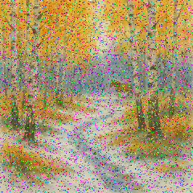
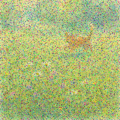

# signets

Code, Documentation, and Datasets related to our paper titled "SIGNETS: Neural Network Architectures for
m-QAM Soft Demodulation". The paper is currently under review at IEEE Access.

This repository will be updated shortly to include the aforementioned content.

Original | Existing Baseline | Proposed | Proposed + finetuning
---------|-------------------|------------|---------------------------
 |  |  | 
 |  |  | 
 |  |  | 
 |  |  | 
